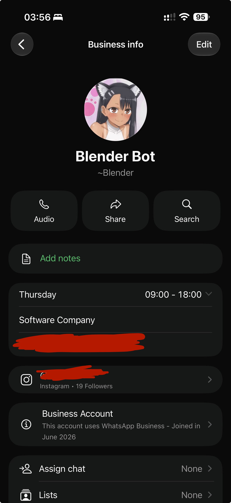

# Blender-Bot-AutoReferral
An automated system that uses Selenium web automation to send a query to the Blender WhatsApp bot for referrals in your dream company, and then automagically sends all your referees a greeting along with your resumé.

  

## How it works

**Step 1:** Send a message to the Blender bot's DMs. The message should say `/company` and nothing more

**Step 2:** Pick out a company you would like to apply to.

**Step 3:** Hardcode the company name, the full path to your tailor-made resumé, and the Blender bot's phone number into the following environment variables on your computer, respectively: `MY_DREAM_COMPANY`, `RFPATH`, and `BLENDER_BOT_NUMBER`

**Step 4:** Clone the repo and do a `pip install -r requirements.txt` in your virtual environment.

**Step 5:** Run the script, and watch referees in your dream company being automatically messaged on your behalf. If you're lucky, you might hear back from some of them.

Good luck, and may the Force be with you!

**NOTE:** The Blender bot's phone number is purposefully being gatekept and is not included in the code. I take no pleasure in doing this, but it is a pretty exclusive bot, so if you know the right people, then well, my repo can help you.

## AI disclosure
Even though I wrote a lot of the code myself, Gemini, ChatGPT, and Claude helped out with various difficult parts of this script, especially during the initial planning and dry-run troubleshooting. The WhatsApp document injection monkeypatching was done by Claude, and I would have never been able to figure it out on my own because I haven't studied JavaScript yet to be very honest.

